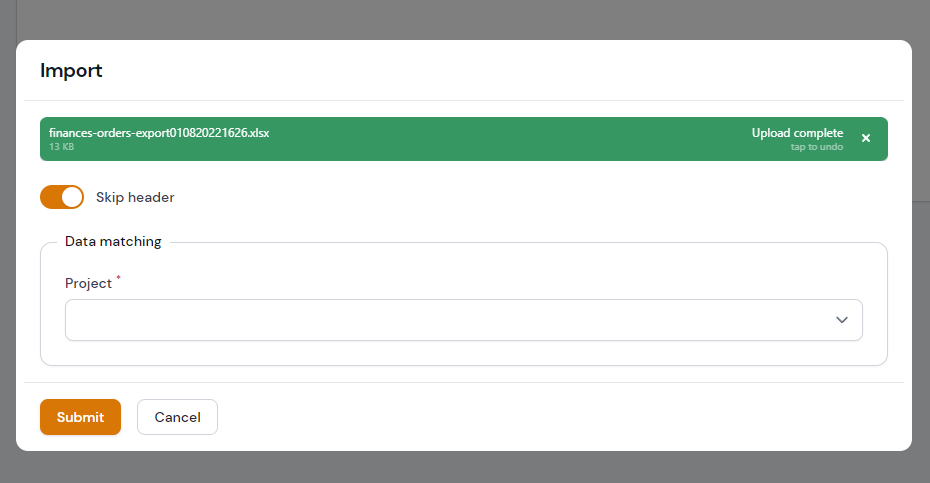

# Filament Plugin for Import CSV and XLS into Database

<a href="https://filamentadmin.com/docs/2.x/admin/installation">
    
</a>
<a href="https://packagist.org/packages/konnco/filament-import">
    
</a>
<a href="https://packagist.org/packages/konnco/filament-import">
    
</a>

[](https://github.com/konnco/filament-import/actions/workflows/php-cs-fixer.yml)
[](https://github.com/konnco/filament-import/actions/workflows/run-tests.yml)

This package will make it easier for you to import from files to your model, very easily without the need to do templates.

all you have to do is drag and drop and match the fields and columns of your file, and let magic happens!

## Installation

You can install the package via composer:

```bash
composer require konnco/filament-import
```

## Publishing Config

If you want to do the settings manually, please publish the existing config.

```bash
php artisan vendor:publish --tag=filament-import-config
```

## Usage

import the actions into `ListRecords` page

```php
use Konnco\FilamentImport\Actions\ImportAction;
use Konnco\FilamentImport\Actions\ImportField;

class ListCredentialDatabases extends ListRecords
{
    protected static string $resource = CredentialDatabaseResource::class;

    protected function getActions(): array
    {
        return [
            ImportAction::make()
                ->fields([
                    ImportField::make('project')
                        ->label('Project')
                        ->helperText('Define as project helper'),
                    ImportField::make('manager')
                        ->label('Manager'),
                ])
        ];
    }
}
```
### Required Field
```php
protected function getActions(): array
{
    return [
        ImportAction::make()
            ->fields([
                ImportField::make('project')
                    ->label('Project')
                    ->required(),
            ])
    ];
}
```

### Disable Mass Create
if you still want to stick with the event model you might need this and turn off mass create
```php
protected function getActions(): array
{
    return [
        ImportAction::make()
            ->massCreate(false)
            ->fields([
                ImportField::make('project')
                    ->label('Project')
                    ->required(),
            ])
    ];
}
```

### Field Data Mutation
you can also manipulate data from row spreadsheet before saving to model
```php
protected function getActions(): array
{
    return [
        ImportAction::make()
            ->fields([
                ImportField::make('project')
                    ->label('Project')
                    ->mutateBeforeCreate(fn($value) => Str::of($value)->camelCase())
                    ->required(),
            ])
    ];
}
```
otherwise you can manipulate data and getting all mutated data from field before its getting insert into the database.
```php
protected function getActions(): array
{
    return [
        ImportAction::make()
            ->fields([
                ImportField::make('email')
                    ->label('Email')
                    ->required(),
            ])->mutateBeforeCreate(function($row){
                $row['password'] = bcrypt($row['email']);

                return $row;
            })
    ];
}
```
it is also possible to manipulate data after it was inserted into the database
```php
use Illuminate\Database\Eloquent\Model;

protected function getActions(): array
{
    return [
        ImportAction::make()
            ->fields([
                ImportField::make('email')
                    ->label('Email')
                    ->required(),
            ])->mutateAfterCreate(function(Model $model, $row){
                // do something with the model

                return $model;
            })
    ];
}
```

### Grid Column
Of course, you can divide the column grid into several parts to beautify the appearance of the data map
```php
protected function getActions(): array
{
    return [
        ImportAction::make()
            ->fields([
                ImportField::make('project')
                    ->label('Project')
                    ->required(),
            ], columns:2)
    ];
}
```

### Json Format Field
We also support the json format field, which you can set when calling the `make` function and separate the name with a dot annotation

```php
protected function getActions(): array
{
    return [
        ImportAction::make()
            ->fields([
                ImportField::make('project.en')
                    ->label('Project In English')
                    ->required(),
                ImportField::make('project.id')
                    ->label('Project in Indonesia')
                    ->required(),
            ], columns:2)
    ];
}
```

### Static Field Data
for the static field data you can use the common fields from filament

```php
use Filament\Forms\Components\Select;

protected function getActions(): array
{
    return [
        ImportAction::make()
            ->fields([
                ImportField::make('name')
                    ->label('Project')
                    ->required(),
                Select::make('status')
                    ->options([
                        'draft' => 'Draft',
                        'reviewing' => 'Reviewing',
                        'published' => 'Published',
                    ])
            ], columns:2)
    ];
}
```

### Unique field
if your model should be unique, you can pass the name of the field, which will be used to check if a row already exists in the database. if it exists, skip that row (preventing an error about non unique row)

```php
use Filament\Forms\Components\Select;

protected function getActions(): array
{
    return [
        ImportAction::make()
            ->uniqueField('email')
            ->fields([
                ImportField::make('email')
                    ->label('Email')
                    ->required(),
            ], columns:2)
    ];
}
```

### Validation
you can make the validation for import fields, for more information about the available validation please check laravel documentation

```php
use Filament\Forms\Components\Select;

protected function getActions(): array
{
    return [
        ImportAction::make()
            ->fields([
                ImportField::make('name')
                    ->label('Project')
                    ->rules('required|min:10|max:255'),
            ], columns:2)
    ];
}
```

### Create Record
you can overide the default record creation closure and put your own code by using `handleRecordCreation` function

```php
use Filament\Forms\Components\Select;

protected function getActions(): array
{
    return [
        ImportAction::make()
            ->fields([
                ImportField::make('name')
                    ->label('Project')
                    ->rules('required|min:10|max:255'),
            ], columns:2)
            ->handleRecordCreation(function($data){
                return Post::create($data);
            })
    ];
}
```


## Testing

```bash
composer test
```

## Changelog

Please see [CHANGELOG](CHANGELOG.md) for more information on what has changed recently.

## Contributing

Please see [CONTRIBUTING](https://github.com/konnco/.github/blob/main/CONTRIBUTING.md) for details.

## Security Vulnerabilities

Please review [our security policy](../../security/policy) on how to report security vulnerabilities.

